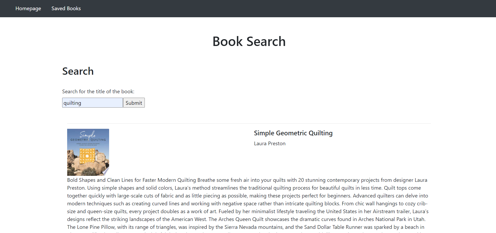

# book-search

## Description
This application allows the user to search for a book title and view the results. If the viewer wishes to view more details about the book, the user can click "view" and be taken to another website that has more details on purchasing the book. If the viewer wishes to save the book for later, then the view can click "save". The "saved books" page displays all of the books that are saved in the database by the user. 

## Credits
The books and their information was provided by Google Books API.